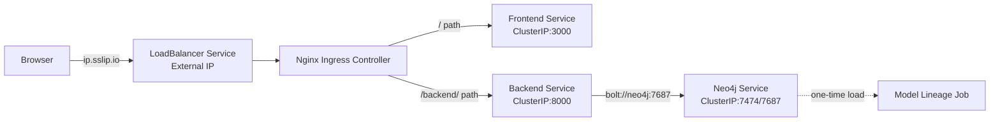
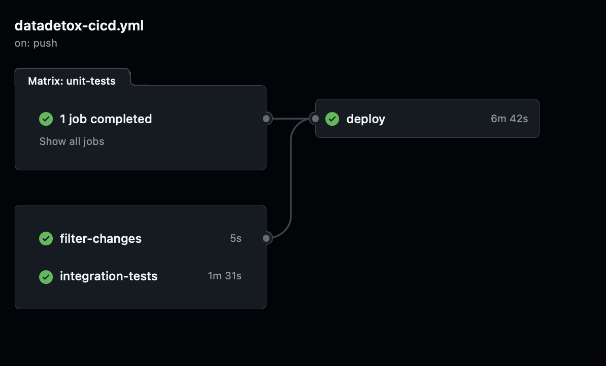
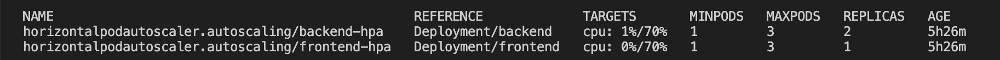
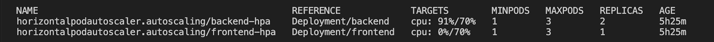

# DataDetox - AC215 Project

**Team Members**: Kushal Chattopadhyay, Keyu Wang, Terry Zhou

**Group Name**: DataDetox

## Project Description


DataDetox is an interactive AI agent orchestration system that leverages MCP, graph-based data, and cloud infrastructure to trace ML data and model provenance, enabling practitioners to explore AI model lineages where otherwise there would exist a critical lack of transparency in model training data and upstream dependencies. Using Hugging Face model information and arXiv papers, the system traces how datasets and models connect across the AI ecosystem, helping developers identify hidden risks like copyrighted data or problematic datasets (e.g., LAION-5B, MS-Celeb-1M) that propagate downstream. Users may ask questions like “Tell me about any datasets or upstream models associated with Qwen3-4B” to assess model risk, receiving visual dependency graphs and clear answers instead of manually piecing together scattered documentation.

To learn more, read our [Medium blog post](https://medium.com/@kchattopadhyay/datadetox-ac215-final-project-0d8b6fdc6dcf?postPublishedType=initial) and watch our [video demo](https://www.youtube.com/watch?v=bCy9Xm_jdP8)!


### Documentation (in `/docs/`)

1. **[Application Design Document](docs/ms4/app_design_doc.md)**

2. **[Data Versioning Documentation](docs/ms4/data_versioning.md)**

3. **[Test Coverage Documentation](docs/ms5/test-coverage.md)**

4. **[Github Automated Deployment Demonstration](docs/ms5/github_deployment_workflow.png.md)**

### Code and Configuration

All source code is organized in the repository:

- **Frontend**: [`/frontend/`](frontend/)
  - React + TypeScript application
  - Components in `frontend/src/components/`
  - Pages in `frontend/src/pages/`

- **Backend**: [`/backend/`](backend/)
  - FastAPI application
  - Agent implementation in `backend/routers/search/`
  - Tests in `backend/tests/`

- **Data Pipeline**: [`/model-lineage/`](model-lineage/)
  - HuggingFace scraper
  - Graph builder and Neo4j client
  - Tests in `model-lineage/tests/`

- **CI/CD Configuration**: [`.github/workflows/`](.github/workflows/)
  - `backend-ci.yml` - Backend testing and linting
  - `model-lineage-ci.yml` - Data pipeline testing
  - Automated testing on push/PR

- **Docker Configuration**:
  - [`docker-compose.yml`](docker-compose.yml) - Multi-service orchestration
  - Individual Dockerfiles in each service directory

- **Dummy Neo4j Container**: [`/neo4j/`](neo4j/)
   - Dummy neo4j container directly pulled from the official Docker image for deployment

### CI Evidence

**Passing CI Run Screenshots**:
- Located in [`docs/ms4/cicd/`](docs/ms4/cicd/)
- Test Coverage in [`docs/ms5/test-coverage.md`](docs/ms5/test-coverage.md)

**View Live CI/CD**:
- Check the [GitHub Actions tab](../../actions) for recent workflow runs
- Coverage reports available in workflow artifacts


## Visualizations
- Landing Page:

    
    
    

- Chatbot Page:

    

- Agentic Workflow:
    

## Prerequisites

### Required Software

- **Docker Desktop** installed ([Get Docker](https://www.docker.com/products/docker-desktop))
- **Docker Compose** (included with Docker Desktop)
- **Python 3.13+** (for local development)
- **Node.js 18+** and **npm** (for frontend development)
- **uv** package manager ([Install uv](https://github.com/astral-sh/uv))

### For Production Deployment (Kubernetes)

- **Google Cloud Platform (GCP) Account** with billing enabled
- **GCP Project** with the following APIs enabled:
  - Compute Engine API
  - Service Usage API
  - Cloud Resource Manager API
  - Artifact Registry API
  - Kubernetes Engine API
- **Pulumi CLI** (installed in deployment container)
- **gcloud CLI** (installed in deployment container)
- **kubectl** (installed in deployment container)

### API Keys and Credentials

- **OpenAI API Key** - Required for LLM-based dataset extraction
  - Get from: https://platform.openai.com/api-keys
- **HuggingFace Token** - Required for accessing HuggingFace Hub
  - Get from: https://huggingface.co/settings/tokens
- **Neo4j Credentials** - Required for graph database
  - Option 1: Use Neo4j AuraDB (cloud) - Get from https://neo4j.com/cloud/aura/
  - Option 2: Use local Neo4j instance via Docker Compose

### GCP Service Accounts (for Production Deployment)

Two service accounts are required for Kubernetes deployment:

1. **`deployment` service account** with roles:
   - Compute Admin
   - Compute OS Login
   - Artifact Registry Administrator
   - Kubernetes Engine Admin
   - Service Account Admin
   - Service Account User
   - Storage Admin

2. **`gcp-service` service account** with roles:
   - Storage Object Viewer
   - Vertex AI Administrator
   - Artifact Registry Reader

See [deployment/README.md](deployment/README.md) for detailed service account setup instructions.

## Environment Configuration

1. **Copy the environment file**:
   ```bash
   cp .env.example .env
   ```

2. **Edit `.env` with your credentials**:
   ```bash
   # Required: Your OpenAI API key
   OPENAI_API_KEY=sk-proj-...

   # Required: Your HuggingFace token
   HF_TOKEN=hf_...

   # Required: Your Neo4j credentials
   NEO4J_URI=neo4j+s://your-instance.databases.neo4j.io
   NEO4J_USER=neo4j
   NEO4J_PASSWORD=your-password
   ```

   **Note**: For local Neo4j, you can use the Docker Compose setup which provides a local instance. For cloud Neo4j, use your cloud instance URI.

## Setup Instructions

### Option 1: Docker Compose (Recommended for Local Development)

This is the easiest way to run the full application stack locally.

1. **Copy environment file**:
   ```bash
   cp .env.example .env
   ```

2. **Edit `.env` with your credentials** (see [Environment Configuration](#environment-configuration) above)

3. **Start all services**:
   ```bash
   docker compose up --build
   ```

   Or run in detached mode:
   ```bash
   docker compose up -d --build
   ```

4. **Access the application**:
   - **Frontend**: http://localhost:3000
   - **Chatbot**: http://localhost:3000/chatbot
   - **Backend API**: http://localhost:8000
   - **API Docs**: http://localhost:8000/docs
   - **Neo4j Browser** (if using local): http://localhost:7474


### Option 2: Local Development (Individual Services)

For developers who want to run services separately for debugging or development:

#### Model Lineage Setup

1. Navigate to the `model-lineage` directory
2. Follow the instructions in `model-lineage/QUICKSTART.md` to set up DVC and Neo4j
3. Run `docker compose up` to create your Neo4j instance with DVC

#### Backend Setup

1. Navigate to the `backend` directory
2. Install dependencies:
   ```bash
   uv sync
   ```
3. Run the FastAPI development server:
   ```bash
   uv run fastapi dev main.py
   ```
   For production, use:
   ```bash
   uv run uvicorn main:app --host 0.0.0.0 --port 8000
   ```
4. Test the API at http://localhost:8000/docs

#### Frontend Setup

1. Navigate to the `frontend` directory
2. Install dependencies:
   ```bash
   npm install
   ```
3. Start the development server:
   ```bash
   npm run dev
   ```
4. Access the frontend at http://localhost:3000

## Deployment Instructions

### Production Deployment to Kubernetes (GCP)

DataDetox is deployed to Google Kubernetes Engine (GKE) using Pulumi for infrastructure as code. The deployment process is automated through GitHub Actions CI/CD.



#### Prerequisites for Deployment

1. **Set up GCP Service Accounts** (see [Prerequisites](#prerequisites) above)
2. **Place service account keys** in the `secrets/` directory:
   - `secrets/deployment.json` - Deployment service account key
   - `secrets/gcp-service.json` - GCP service account key
3. **Configure deployment container**:
   - Edit `deployment/docker-shell.sh` and set `GCP_PROJECT` to your project ID

#### Step 1: Build and Push Docker Images

1. **Enter the deployment container**:
   ```bash
   cd deployment
   sh docker-shell.sh
   ```

2. **Build and push images to Google Container Registry**:
   ```bash
   cd deploy_images
   pulumi stack init dev  # First time only
   pulumi config set gcp:project <your-project-id> --stack dev
   pulumi up --stack dev -y
   ```

   This builds and pushes:
   - Backend container
   - Frontend container
   - Neo4j container
   - Model-lineage container


#### Step 2: Deploy to Kubernetes Cluster

1. **Deploy the Kubernetes cluster and services**:
   ```bash
   cd ../deploy_k8s
   pulumi stack init dev  # First time only
   pulumi config set gcp:project <your-project-id>
   pulumi config set security:gcp_service_account_email deployment@<your-project-id>.iam.gserviceaccount.com --stack dev
   pulumi config set security:gcp_ksa_service_account_email gcp-service@<your-project-id>.iam.gserviceaccount.com --stack dev
   pulumi up --stack dev --refresh -y
   ```

2. **Get the application URL** from Pulumi output:
   ```
   Outputs:
       app_url: "http://34.9.143.147.sslip.io"
   ```

3. **Access your deployed application** at the `app_url`


#### Step 3: Populate Neo4j Database (Optional)

The model-lineage deployment starts with 0 replicas. To populate the Neo4j database:

```bash
# Get cluster credentials
gcloud container clusters get-credentials <cluster-name> --zone us-central1-a --project <project-id>

# Scale up the model-lineage deployment
kubectl scale deployment/model-lineage --replicas=1 -n datadetox-namespace

# Wait for pod to be ready
kubectl wait --for=condition=ready pod -l app=model-lineage -n datadetox-namespace

# Exec into the container and run scraper
kubectl exec -it deployment/model-lineage -n datadetox-namespace -- bash
uv run python lineage_scraper.py --full --limit 25000 # WARNING: This will take a long time, adjust the limit as needed

# Scale back down when done
kubectl scale deployment/model-lineage --replicas=0 -n datadetox-namespace
```

#### Automated Deployment via CI/CD

The application is automatically deployed when changes are merged to the `main` branch:

1. **GitHub Actions workflow** runs:
   - Unit tests (backend, model-lineage)
   - Integration tests
   - Coverage checks (minimum 60%)
   - Docker image builds
   - Kubernetes deployment

2. **View deployment status**:
   - Check GitHub Actions tab: https://github.com/kushal-chat/actions
   - View workflow: `.github/workflows/datadetox-cicd.yml`



#### Scaling the Application

The Kubernetes deployment supports horizontal pod autoscaling. It automatically scales the number of pods in response to load. To manually scale:

```bash
# Scale backend
kubectl scale deployment/backend --replicas=3 -n datadetox-namespace

# Scale frontend
kubectl scale deployment/frontend --replicas=2 -n datadetox-namespace

# View current replicas
kubectl get deployments -n datadetox-namespace
```




For detailed deployment instructions, see [deployment/README.md](deployment/README.md).

## Usage Guidelines

### Running the Full-Stack Application Locally

1. **Start all services** using Docker Compose:
   ```bash
   docker compose up
   ```

2. **Access the chatbot**:
   - Navigate to http://localhost:3000/chatbot
   - Enter queries about models (e.g., "Tell me about BERT models" or "What datasets were used to train qwen3-4b?")
   - The system will:
     - Search HuggingFace for model information
     - Query Neo4j for model lineage relationships
     - Extract training dataset information from arXiv papers
     - Assess dataset risks
     - Display results in an interactive graph

3. **Explore the API**:
   - Visit http://localhost:8000/docs for interactive API documentation
   - Test the `/backend/flow/search` endpoint with sample queries

### Example Queries

Here are some example queries you can try:

- **Model Information**: "Tell me about BERT models"
- **Model Lineage**: "What are the upstream dependencies of qwen3-4b?"
- **Dataset Extraction**: "What models are trained on GSM8K?"
- **Graph Exploration**: "Show me the complete lineage graph for this model"

### Common Commands

#### Docker Compose Commands

```bash
# Start services
docker compose up

# Start in background
docker compose up -d

# Rebuild containers
docker compose up --build

# Stop services
docker compose down

# View logs
docker compose logs -f

# View specific service logs
docker compose logs -f backend
docker compose logs -f frontend

# Restart a service
docker compose restart backend
```

#### Kubernetes Commands

```bash
# Get cluster credentials
gcloud container clusters get-credentials <cluster-name> --zone us-central1-a --project <project-id>

# View all resources
kubectl get all -n datadetox-namespace

# View pods
kubectl get pods -n datadetox-namespace

# View logs
kubectl logs -f deployment/backend -n datadetox-namespace

# Scale deployments
kubectl scale deployment/backend --replicas=3 -n datadetox-namespace

# Delete deployment
kubectl delete deployment backend -n datadetox-namespace
```

## Services Overview

The application consists of the following services:

### 1. Backend (Port 8000)
- FastAPI application
- Handles search agent queries
- Connects to Neo4j and HuggingFace
- Provides REST API endpoints

### 2. Frontend (Port 3000)
- React + Vite application
- User interface for the chatbot
- Pre-configured to connect to backend at `http://localhost:8000`

### 3. Neo4j (Ports 7474, 7687) - Optional
- Graph database for model lineage
- Browser UI at http://localhost:7474
- Can use cloud Neo4j instead (configure in `.env`)

### 4. Model Lineage Scraper - Optional
- Scrapes HuggingFace model relationships
- Populates Neo4j database
- Run via: `docker compose run model-lineage-scraper uv run python lineage_scraper.py --full`

### CI/CD and Testing

- Check that CI/CD tests pass in the GitHub Actions tab
- View coverage reports in `.github/workflows/` or the `coverage.xml` files
- Run tests locally:
  ```bash
  # Backend tests
  cd backend && uv run pytest

  # Model-lineage tests
  cd model-lineage && uv run pytest
  ```

## Known Issues and Limitations

### Current Limitations

1. **Neo4j Database Population**
   - The Neo4j database must be manually populated using the model-lineage scraper
   - Large-scale scraping (full HuggingFace catalog) can take several hours
   - The database starts empty in new deployments (intentional to avoid overwriting existing database and wasting time on redeployment)

2. **Dataset Extraction from arXiv**
   - Dataset extraction relies on parsing PDF content, which may not always be accurate
   - Some papers may not contain explicit dataset information
   - LLM-based extraction requires OpenAI API access and incurs API costs

3. **Model Coverage**
   - Only models available on HuggingFace Hub are searchable
   - Models not in the Neo4j database will not show lineage relationships
   - Limited to publicly available model information

4. **Rate Limiting**
   - HuggingFace API has rate limits that may affect large batch operations
   - OpenAI API rate limits apply to LLM-based extraction
   - Neo4j query performance depends on graph size

5. **Scalability**
   - The current deployment uses a single Neo4j instance (not clustered)
   - Large graph queries may be slow on very large datasets
   - Frontend and backend scale horizontally, but Neo4j is a single point of failure

6. **Error Handling**
   - Some external API failures may not be gracefully handled
   - Network timeouts may cause incomplete results
   - PDF parsing failures are logged but may not provide user feedback

### Known Issues

1. **Environment Variables**
   - Missing environment variables may cause silent failures
   - Ensure all required API keys are set in `.env` or Kubernetes secrets

2. **Docker Compose Networking**
   - Services must be started in the correct order (Neo4j before backend)
   - Port conflicts may occur if services are already running

3. **Kubernetes Deployment**
   - First-time deployment requires manual service account setup
   - Pulumi state is stored in GCS, ensure bucket permissions are correct
   - SSL/TLS setup is optional and requires additional configuration

4. **Test Coverage**
   - Some async operations have limited unit test coverage (see [test-coverage.md](docs/ms5/test-coverage.md))
   - Integration tests require proper mocking of external services
   - CI/CD tests may fail if external API keys are not configured

### Workarounds

1. **For Neo4j Population**: Use the model-lineage scraper with `--limit` flag to populate a subset of models first
2. **For API Rate Limits**: Implement retry logic with exponential backoff (partially implemented)
3. **For PDF Parsing Failures**: The system falls back to LLM-based extraction when PDF parsing fails
4. **For Missing Lineage Data**: The system will still provide HuggingFace search results even without Neo4j data

### Future Improvements

- [ ] Add caching layer for frequently accessed models to reduce latency
- [ ] Improve PDF parsing accuracy with better extraction algorithms
- [ ] Add support for more model repositories beyond HuggingFace
- [ ] Add monitor to proactively look out for risks associated with datasets and models
- [ ] Enhance neo4j scalability with neo4j clustering
- [ ] Add comprehensive error handling and user feedback
- [ ] Add monitoring and alerting for production deployments
