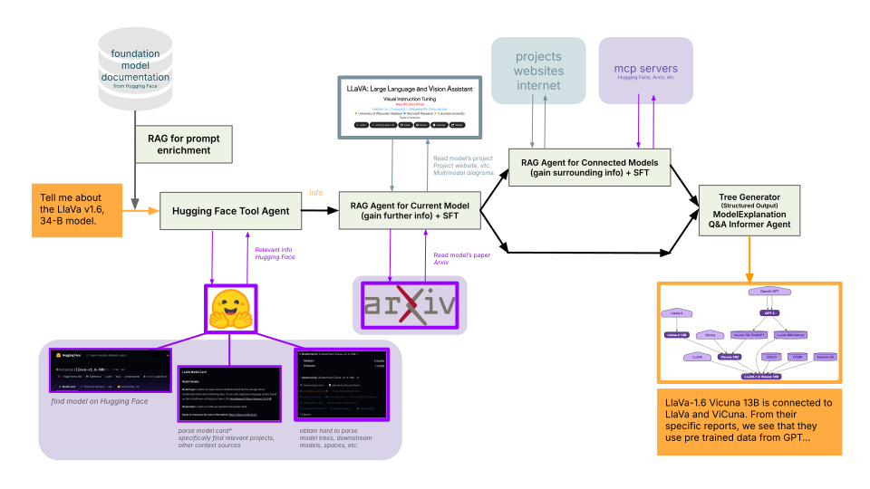

# DataDetox - AC215 Project

**Team Members**: Kushal Chattopadhyay, Terry Zhou, Keyu Wang

**Group Name**: DataDetox

## Project Description

DataDetox is an AI-powered application designed to help users understand model lineages and their associated data. The current system leverages Retrieval-Augmented Generation (RAG) to provide enriched information about foundation models by retrieving relevant details from comprehensive model documentation from HuggingFace.

## How to Run (for developers)

1. Follow the steps listed in `model-lineage` to `docker compose up` and create your Neo4j instance with DVC.
2. Go to `backend` and run `uv run fastapi dev main.py`. (For prod, use `docker` and `uvicorn`.)
3. Test JSON inputs to the API endpoint in the `/docs` link.
4. Check that CI/CD tests pass, and view the `coverage report`.

## How to Run Full-Stack

1. [IDEAL] Run `docker compose up` from the base directory.
2. Go to the frontend website and enter queries.
3. Interact with the LLM and the trees from Neo4j.

## Visualizations
- Landing Page:

    
    
    

- Chatbot Page:

    

- Agentic Workflow:
    
