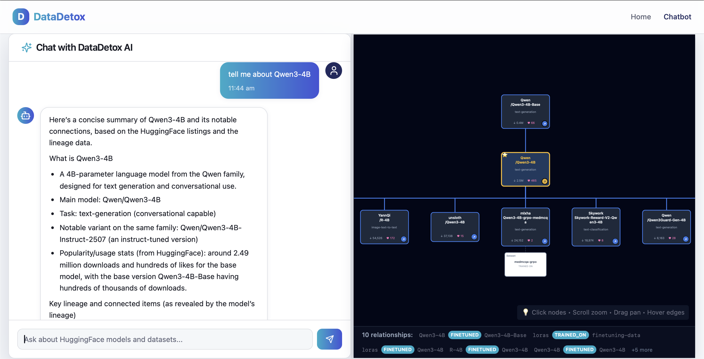

# DataDetox - AC215 Project

**Team Members**: Kushal Chattopadhyay, Keyu Wang, Terry Zhou

**Group Name**: DataDetox

## Project Description


DataDetox is an interactive AI agent orchestration system that leverages MCP, graph-based data, and cloud infrastructure to trace ML data and model provenance, enabling practitioners to explore AI model lineages where otherwise there would exist a critical lack of transparency in model training data and upstream dependencies. Using Hugging Face model information and arXiv papers, the system traces how datasets and models connect across the AI ecosystem, helping developers identify hidden risks like copyrighted data or problematic datasets (e.g., LAION-5B, MS-Celeb-1M) that propagate downstream. Users may ask questions like “Tell me about any datasets or upstream models associated with qwen3-4b” to assess model risk, receiving visual dependency graphs and clear answers instead of manually piecing together scattered documentation.

## Visualizations
- Landing Page:

    
    
    

- Chatbot Page:

    

- Agentic Workflow:
    

## Prerequisites

- **Docker Desktop** installed ([Get Docker](https://www.docker.com/products/docker-desktop))
- **Docker Compose** (included with Docker Desktop)
- **API Keys and Credentials**:
  - OpenAI API key
  - HuggingFace token
  - Neo4j credentials (cloud instance or local)

## Environment Configuration

1. **Copy the environment file**:
   ```bash
   cp .env.example .env
   ```

2. **Edit `.env` with your credentials**:
   ```bash
   # Required: Your OpenAI API key
   OPENAI_API_KEY=sk-proj-...

   # Required: Your HuggingFace token
   HF_TOKEN=hf_...

   # Required: Your Neo4j credentials
   NEO4J_URI=neo4j+s://your-instance.databases.neo4j.io
   NEO4J_USER=neo4j
   NEO4J_PASSWORD=your-password
   ```

   **Note**: For local Neo4j, you can use the Docker Compose setup which provides a local instance. For cloud Neo4j, use your cloud instance URI.

## Setup Instructions

### Option 1: Docker Compose (Recommended)

This is the easiest way to run the full application stack.

1. **Start all services**:
   ```bash
   docker compose up --build
   ```

   Or run in detached mode:
   ```bash
   docker compose up -d --build
   ```

2. **Access the application**:
   - **Frontend**: http://localhost:3000
   - **Chatbot**: http://localhost:3000/chatbot
   - **Backend API**: http://localhost:8000
   - **API Docs**: http://localhost:8000/docs
   - **Neo4j Browser** (if using local): http://localhost:7474

### Option 2: Local Development

For developers who want to run services separately:

#### Model Lineage Setup

1. Navigate to the `model-lineage` directory
2. Follow the instructions in `model-lineage/QUICKSTART.md` to set up DVC and Neo4j
3. Run `docker compose up` to create your Neo4j instance with DVC

#### Backend Setup

1. Navigate to the `backend` directory
2. Install dependencies:
   ```bash
   uv sync
   ```
3. Run the FastAPI development server:
   ```bash
   uv run fastapi dev main.py
   ```
   For production, use:
   ```bash
   uv run uvicorn main:app --host 0.0.0.0 --port 8000
   ```
4. Test the API at http://localhost:8000/docs

#### Frontend Setup

1. Navigate to the `frontend` directory
2. Install dependencies:
   ```bash
   npm install
   ```
3. Start the development server:
   ```bash
   npm run dev
   ```
4. Access the frontend at http://localhost:3000

## Usage Guidelines

### Running the Full-Stack Application

1. **Start all services** using Docker Compose (recommended):
   ```bash
   docker compose up
   ```

2. **Access the chatbot**:
   - Navigate to http://localhost:3000/chatbot
   - Enter queries about models (e.g., "Tell me about BERT models")
   - Interact with the LLM and explore model lineage trees from Neo4j

3. **Explore the API**:
   - Visit http://localhost:8000/docs for interactive API documentation
   - Test endpoints with sample JSON inputs

### Common Commands

#### Docker Compose Commands

```bash
# Start services
docker compose up

# Start in background
docker compose up -d

# Rebuild containers
docker compose up --build

# Stop services
docker compose down

# View logs
docker compose logs -f

# View specific service logs
docker compose logs -f backend
docker compose logs -f frontend

# Restart a service
docker compose restart backend
```

## Services Overview

The application consists of the following services:

### 1. Backend (Port 8000)
- FastAPI application
- Handles search agent queries
- Connects to Neo4j and HuggingFace
- Provides REST API endpoints

### 2. Frontend (Port 3000)
- React + Vite application
- User interface for the chatbot
- Pre-configured to connect to backend at `http://localhost:8000`

### 3. Neo4j (Ports 7474, 7687) - Optional
- Graph database for model lineage
- Browser UI at http://localhost:7474
- Can use cloud Neo4j instead (configure in `.env`)

### 4. Model Lineage Scraper - Optional
- Scrapes HuggingFace model relationships
- Populates Neo4j database
- Run via: `docker compose run model-lineage-scraper uv run python lineage_scraper.py --full`


### CI/CD and Testing

- Check that CI/CD tests pass in the GitHub Actions tab
- View coverage reports in `.github/workflows/` or the `coverage.xml` files
- Run tests locally:
  ```bash
  # Backend tests
  cd backend && uv run pytest

  # Model-lineage tests
  cd model-lineage && uv run pytest
  ```
