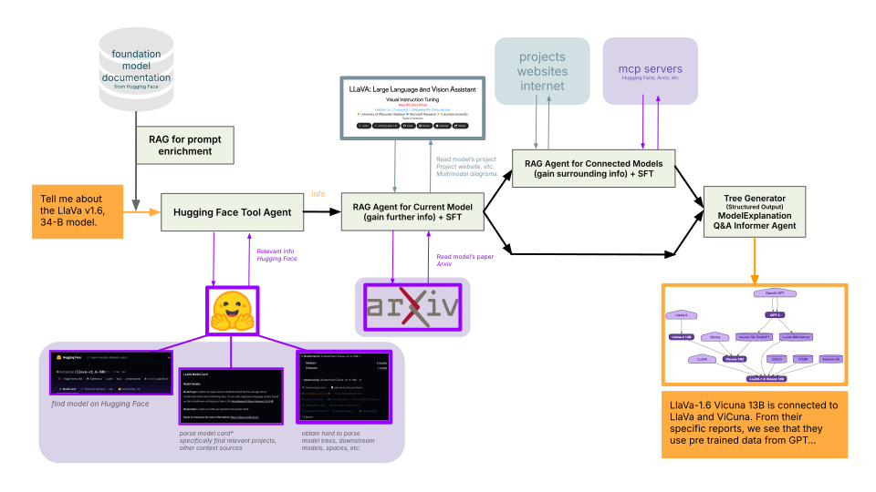
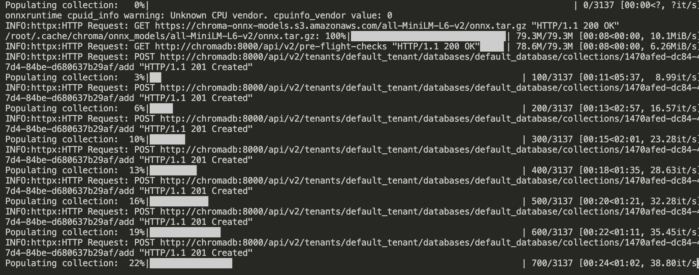
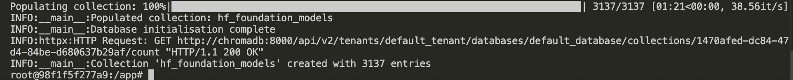
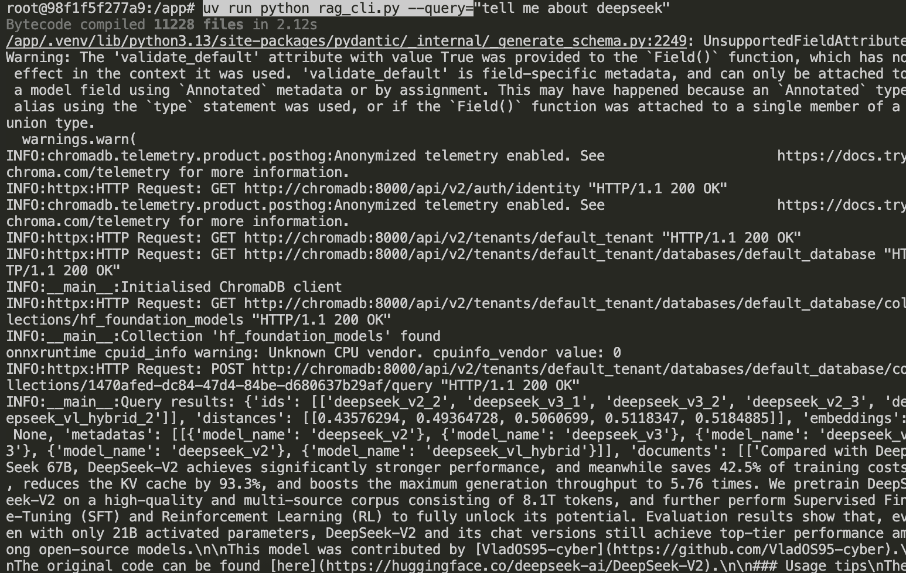
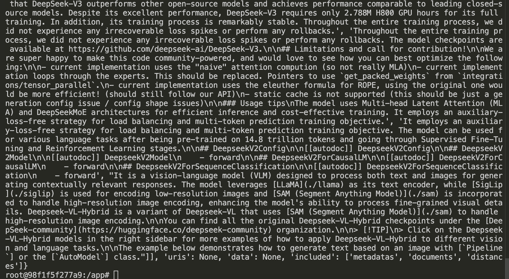

# DataDetox - AC215 Project

**Team Members**: Kushal Chattopadhyay, Terry Zhou, Keyu Wang

**Group Name**: DataDetox

## Project Description

DataDetox is an AI-powered application designed to help users understand model lineages and their associated data. The current system leverages Retrieval-Augmented Generation (RAG) to provide enriched information about foundation models by retrieving relevant details from comprehensive model documentation from HuggingFace.

## Project Wireframe & Workflow (Missing from Milestone 1)
- Landing Page:

    
    
    

- Chatbot Page:

    

- Agentic Workflow (included in Milestone 1):
    

Screenshots of landing and chatbot pages also are added to previous submitted MS1 pdf, see Figure 3, 4, 5 in [report/AC215_MileStone_1.pdf](report/AC215_MileStone_1.pdf).

## Project Organization

```
├── README.md
├── docker-compose.yml
├── uv.lock
│
├── backend
│   ├── Dockerfile
│   ├── pyproject.toml
│   ├── README.md
│   ├── uv.lock
│   ├── ... # details omitted as it's not perfectly structured yet
│
├── frontend
│   ├── Dockerfile
│   ├── README.md
│   ├── ... # details omitted as it's not perfectly structured yet
│
├── data ⭐️   # downloaded data should be stored here
│
├── rag ⭐️
│   ├── Dockerfile
│   ├── pyproject.toml
│   ├── rag_cli.py
│   ├── README.md
│   ├── uv.lock
│   └── data/
│
├── mcp
│   ├── ... # details omitted as it's not perfectly structured yet
│
├── img
│   ├── ... # images used for README
│
└── report
    └── AC215_Milestone_1.pdf


```

## Getting Started

Clone the repository:
```bash
git clone https://github.com/kushal-chat/AC215_datadetox.git
cd AC215_datadetox
```

## Milestone 2 Components

### 1. Data Source

Our data source for RAG are markdown files coming from the [HuggingFace Transformers documentation](https://github.com/huggingface/transformers/tree/main/docs/source/en/model_doc) and are uploaded to our GCS bucket. 

Download the data by running:
```bash
chmod +x download_model_doc.sh
./download_model_doc.sh
```

You will see new 419 markdown files downloaded in `data/model_doc` folder.


**Data Preservation Note**: We intentionally did not preprocess the `.md` files downloaded from HuggingFace, to preserve all the details of the foundation model data. This ensures that the RAG system has access to complete and accurate information about each foundation model.


### 2. RAG System

Our Retrieval-Augmented Generation system serves as a **prompt refining tool** that retrieves information about foundation models and enriches user prompts. When a user mentions something about a foundation model, the RAG system:
- Retrieves relevant information from the foundation model documentation
- Enriches the user's prompt with detailed context about the model

#### Functions

This RAG CLI tool uses ChromaDB and LlamaIndex, provides functionality to:
- Initialise and populate the vector database from a directory by: 
    - Ingest markdown documents from a directory
    - Chunk documents using sentence splitting
    - Store documents in ChromaDB with vector embeddings
- Query the database for relevant document chunks

#### Set up 

**STEP 1:** To run the containerised pipeline with docker, first start the `rag_cli` and `chromadb` containers by inputting the following commands at the root level of the project: 
```bash
docker compose up -d rag_cli
```
- You should see outputs like:

- Also inside your *docker desktop*, you should see the containers runnning like:


**STEP 2:** Go inside the rag_cli container with: 
```bash
docker compose exec rag_cli bash 
```

- You will see your bash becomes something like: `root@98f1f5f277a9:/app#` (the number after "@" may be different)

#### Initialise Database

**STEP 3:** To create a new database collection from markdown documents:

```bash
uv run python rag_cli.py --init_db=True --input_data_path="data/model_doc" --collection_name="hf_foundation_models"
```

**Parameters:**
- `--init_db`: Flag to initialise the database
- `--input_data_path`: Path to directory containing markdown files (default: "data/model_doc")
- `--collection_name`: Name of the ChromaDB collection (default: "hf_foundation_models")
- `--chunk_size`: Size of text chunks in characters (default: 256)
- `--chunk_overlap`: Overlap between chunks in characters (default: 32)

You should see outputs like:


 at the end of the output.


#### Query Database

**STEP 4:** To query the existing database:

```bash
uv run python rag_cli.py --query=<enter-your-query> --collection_name="hf_foundation_models" --n_results=5
```

**Parameters:**
- `--query`: The search query string
- `--collection_name`: Name of the ChromaDB collection to query
- `--n_results`: Number of results to return (default: 5)

You should see outputs like:
 


For more details, see [rag/README.md](rag/README.md).

