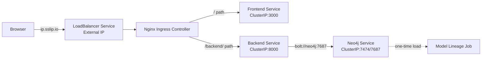

# Deployment & Scaling

## Set up

### API's to enable in GCP before you begin
Search for each of these in the GCP search bar and click enable to enable these API's
* Compute Engine API
* Service Usage API
* Cloud Resource Manager API
* Artifact Registry API

#### Setup GCP Service Account for deployment
- Here are the step to create a service account:
- To setup a service account you will need to go to [GCP Console](https://console.cloud.google.com/home/dashboard), search for  "Service accounts" from the top search box. or go to: "IAM & Admins" > "Service accounts" from the top-left menu and create a new service account called "deployment".
- Give the following roles:
- For `deployment`:
    - Compute Admin
    - Compute OS Login
    - Artifact Registry Administrator
    - Kubernetes Engine Admin
    - Service Account Admin
    - Service Account User
    - Storage Admin
- Then click done.
- This will create a service account
- On the right "Actions" column click the vertical ... and select "Create key". A prompt for Create private key for "deployment" will appear select "JSON" and click create. This will download a Private key json file to your computer. Copy this json file into the **secrets** folder.
- Rename the json key file to `deployment.json`
- Follow the same process Create another service account called `gcp-service`
- For `gcp-service` give the following roles:
    - Storage Object Viewer
    - Vertex AI Administrator
    - Artifact Registry Reader
- Then click done.
- This will create a service account
- On the right "Actions" column click the vertical ... and select "Create key". A prompt for Create private key for "gcp-service" will appear select "JSON" and click create. This will download a Private key json file to your computer. Copy this json file into the **secrets** folder.
- Rename the json key file to `gcp-service.json`

### Setup Docker Container (Pulumi, Docker, Kubernetes)

#### Run `deployment` container
- cd into `deployment`
- Go into `docker-shell.sh` and change `GCP_PROJECT` to your project id
- Run `sh docker-shell.sh`

- Check versions of tools:
```
gcloud --version
pulumi version
kubectl version --client
```

- Check to make sure you are authenticated to GCP
- Run `gcloud auth list`

Now we have a Docker container that connects to your GCP and can create VMs, deploy containers all from the command line

### SSH Setup
#### Configuring OS Login for service account
Run this within the `deployment` container
```
gcloud compute project-info add-metadata --project <YOUR GCP_PROJECT> --metadata enable-oslogin=TRUE
```

#### Create SSH key for service account
```
cd /secrets
ssh-keygen -f ssh-key-deployment
cd /app
```

#### Providing public SSH keys to instances
```
gcloud compute os-login ssh-keys add --key-file=/secrets/ssh-key-deployment.pub
```
From the output of the above command keep note of the username. Here is a snippet of the output
```
- accountId: ac215-project
    gid: '3906553998'
    homeDirectory: /home/sa_100110341521630214262
    name: users/deployment@ac215-project.iam.gserviceaccount.com/projects/ac215-project
    operatingSystemType: LINUX
    primary: true
    uid: '3906553998'
	...
    username: sa_100110341521630214262
```
The username is `sa_100110341521630214262`


## Deployment with Scaling using Kubernetes

In this section we will deploy the app to a K8s cluster.

### Build and Push Docker Containers to GCR
**This step is only required if you have NOT already done this**
- cd into `deploy_images`
- When setting up pulumi for the first time run:
```
pulumi stack init dev
pulumi config set gcp:project <your-project> --stack dev
```

This will save all the deployment states to a GCP bucket

- If a stack has already been setup, you can preview deployment using:
```
pulumi preview --stack dev
```

- To build & push images run (This will take a while since we need to build 4 containers):
```
pulumi up --stack dev -y
```

- To build specific containers only:
```
# Build only backend
pulumi up --stack dev --target "urn:pulumi:dev::datadetox-deployment::docker-build:index:Image::build-datadetox-backend"

# Build only frontend
pulumi up --stack dev --target "urn:pulumi:dev::datadetox-deployment::docker-build:index:Image::build-datadetox-frontend"
```

## Create & Deploy Cluster
- cd into `deploy_k8s` from the `deployment` folder
- When setting up pulumi for the first time run:
```
pulumi stack init dev
pulumi config set gcp:project <your-project-id>
pulumi config set security:gcp_service_account_email deployment@<your-project-id>.iam.gserviceaccount.com --stack dev
pulumi config set security:gcp_ksa_service_account_email gcp-service@<your-project-id>.iam.gserviceaccount.com --stack dev
```
This will save all your deployment states to a GCP bucket

- If a stack has already been setup, you can preview deployment using:
```
pulumi preview --stack dev --refresh
```

- To create a cluster and deploy all our container images run:
```
pulumi up --stack dev --refresh -y
```

Here is how the various services communicate between each other in the Kubernetes cluster.



### Populating Neo4j database
1. Default behaivour: Deployment is created but scaled to 0 replicas (no pods running)

2. To use it manually:
```
# Scale up the deployment
kubectl scale deployment/model-lineage --replicas=1 -n datadetox-namespace

# Wait for pod to be ready
kubectl wait --for=condition=ready pod -l app=model-lineage -n datadetox-namespace

# Exec into the container
kubectl exec -it deployment/model-lineage -n datadetox-namespace -- bash

# Inside the container, run your scraper
uv run python lineage_scraper.py --full --limit 1000
# Or any other command you want
```

3. When done, scale back down to save resources:
```
kubectl scale deployment/model-lineage --replicas=0 -n datadetox-namespace
```

4. Optional: To run automatically on setup:
```
pulumi config set run_model_lineage_on_setup true --stack dev
```

### Try some kubectl commands
```
gcloud container clusters get-credentials <cluster-name> --zone <project-zone> --project <project-id>
gcloud container clusters get-credentials datadetox-cluster --zone us-central1-a --project fit-bulwark-471117-v6
kubectl get all
kubectl get all --all-namespaces
kubectl get pods --all-namespaces
kubectl get pods -n datadetox-namespace
```

```
kubectl get componentstatuses
kubectl get nodes
```

```
# Delete the deployments
kubectl delete deployment frontend -n datadetox-namespace

# Delete the model-lineage job and any related pods
kubectl delete job model-lineage -n datadetox-namespace
kubectl delete pods -n datadetox-namespace -l job-name=model-lineage

# Delete the services (optional - if you want to remove them too)
kubectl delete service neo4j backend -n datadetox-namespace
```

### If you want to shell into a container in a Pod
```
kubectl get pods --namespace=datadetox-namespace
kubectl get pod api-c4fb784b-2llgs --namespace=datadetox-namespace
kubectl exec --stdin --tty api-c4fb784b-2llgs --namespace=datadetox-namespace  -- /bin/bash
```

### View the App
* From the terminal view the results of Pulumi
```
Outputs:
    app_url         : "http://34.9.143.147.sslip.io"
    cluster_endpoint: "104.197.105.203"
    cluster_name    : "cheese-app-cluster"
    ingress_name    : "nginx-ingress"
    kubeconfig      : [secret]
    namespace       : "cheese-app-namespace"
    nginx_ingress_ip: "34.9.143.147"
```
* Go to `app_url`

### Targeted Updates with Pulumi

```
# To find the exact urn
pulumi stack --show-urns | grep frontend

# Update only the frontend deployment
pulumi up --stack dev --target 'urn:pulumi:dev::datadetox-deploy-k8s::kubernetes:apps/v1:Deployment::frontend'

# Update only the backend deployment
pulumi up --stack dev --target 'urn:pulumi:dev::datadetox-deploy-k8s::kubernetes:apps/v1:Deployment::backend'
```

### Delete Cluster
```
pulumi destroy --stack dev --refresh -y
```

---
